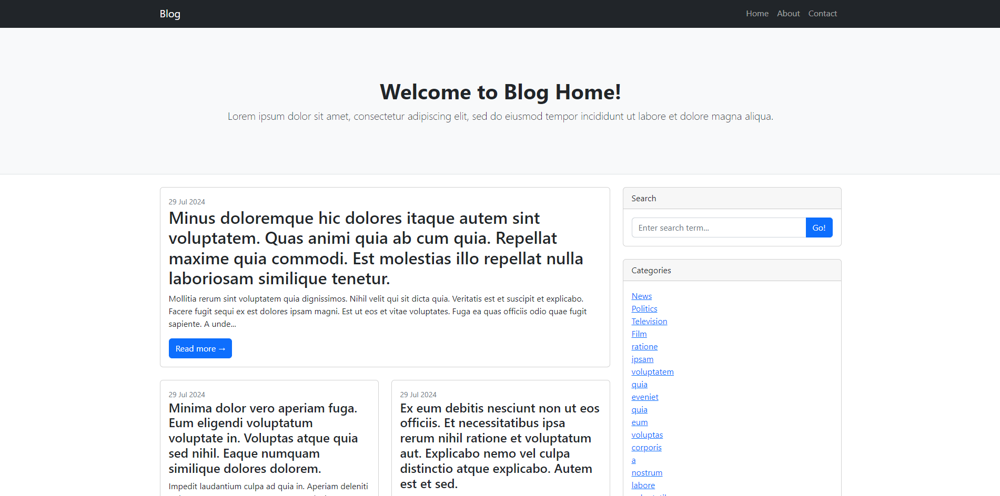
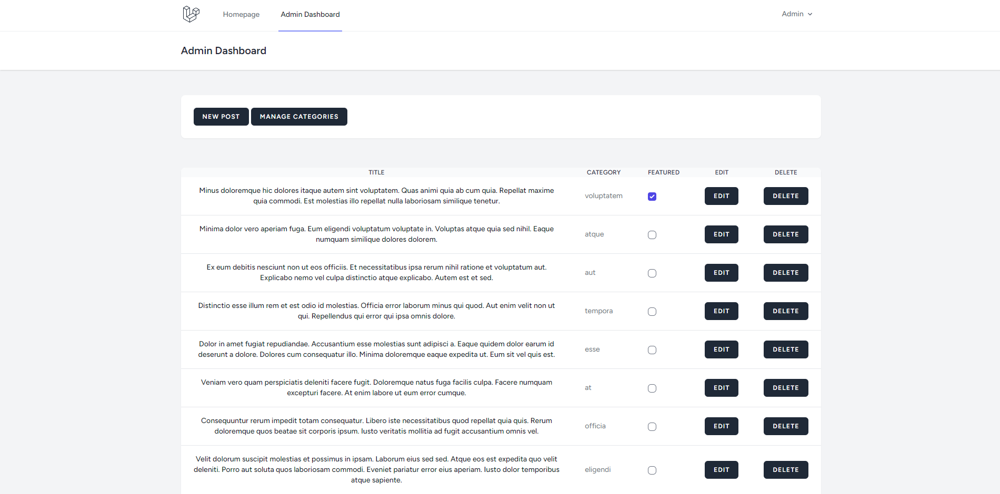

    

## About

A simple CMS for a personal blog. Blog features include search, categories and a contact form. Admin panel features include creating, editing and deleting categories, creating, editing and deleting posts, and making a post/posts featured.

    

## Installation

Run [php artisan migrate --seed] to migrate and create the admin user.

## License

The Laravel framework is open-sourced software licensed under the [MIT license](https://opensource.org/licenses/MIT).
