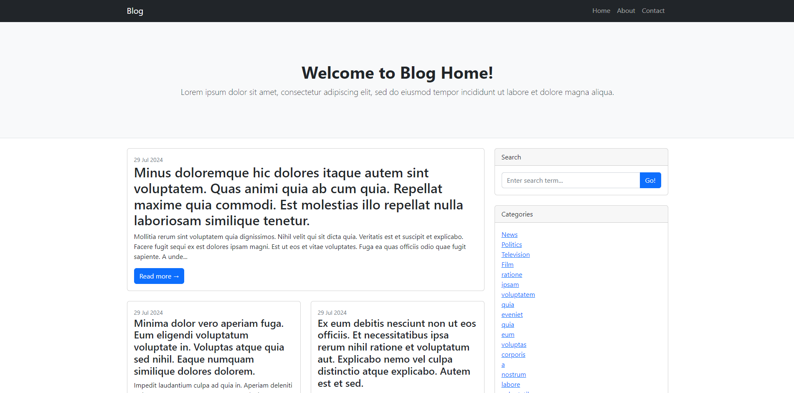
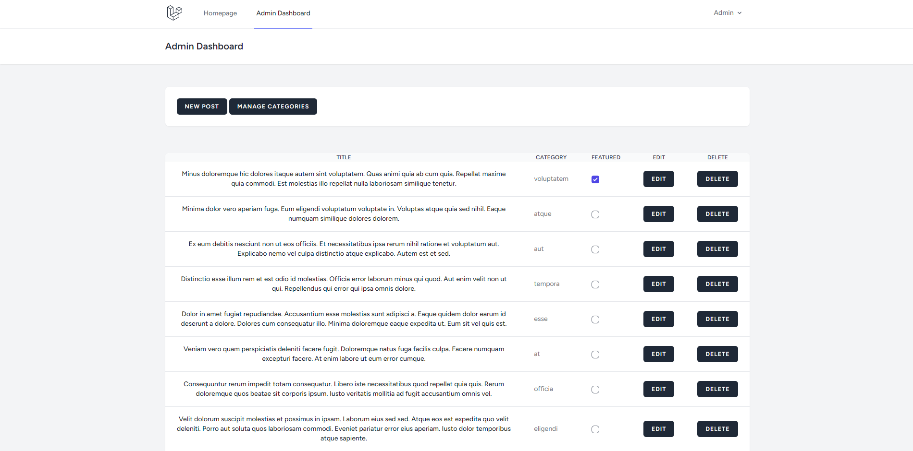

# Blog CMS

    

## About

A simple CMS for a personal blog. Blog features include search, categories and a contact form. Admin panel features include creating, editing and deleting categories, creating, editing and deleting posts, and making a post/posts featured.

    

## Installation

1. Run `git clone https://github.com/smtack/blog-cms.git` then `cd blog-cms`
2. Run `composer install` then `npm install`
3. Run `cp .env.example .env` and update for your database, then `php artisan key:generate`
4. Run `php artisan migrate --seed` to migrate and create the admin user.
5. Create `images` folder in `storage/app/public` then run `php artisan storage:link` to create folder for image uploads.
6. Run `composer run dev` to start the development server

The email for the default admin user is `admin@example.com` and the password is `password`. Change these in the Admin settings.

## License

The Laravel framework is open-sourced software licensed under the [MIT license](https://opensource.org/licenses/MIT).
